# @XploraTours-Travels

@XploraTours-Travels is a full-stack application consisting of a backend built with Node.js, Express.js, and Prisma ORM, and a frontend built with Angular. It provides a RESTful API for managing tours and bookings for a travel agency, as well as a user interface for interacting with the application.

## Features

- Create, read, update, and delete tours
- Activate and deactivate tours
- View active and inactive tours
- Search for tours by destination
- Create bookings for tours
- View bookings for a specific tour
- View total bookings count for a tour
- View total amount earned per tour
- View total amount spent by a user
- View total amount earned collectively by the company

## Technologies Used

### Backend


- Node.js
- Express.js
- Prisma ORM
- SQL Server

### Frontend


- Angular
- TypeScript
- HTML/CSS

## Getting Started

### Prerequisites

- Node.js (v14 or later)
- npm (Node Package Manager)
- Angular CLI
- SQL Server (or any other database supported by Prisma)

### Installation

1. **Clone the repository:**

   ```bash
   git clone https://github.com/your-username/XploraTours-Travels.git

2. **Navigate to the project directory**

   ```bash
   cd XploraTours-Travels

3. **Install backend dependencies:**

   ```bash
   cd backend-prisma
   npm install

4. **Install backend dependencies:**
      Create a new SQL Server database (or use an existing one).
      Rename the .env.example file to .env and update the database connection details.

5. **Run database migrations for the backend:**

   ```bash
   npx prisma migrate dev


6. **Start the backend development server:**

   ```bash
   npm run dev

 The backend server should now be running at http://localhost:4115.

7. **Navigate back to the project root directory:**

   ```bash
   cd ..

8. **Install frontend dependencies:**

   ```bash
   cd frontend-angular
   npm install

9. **Start the frontend development server:**

   ```bash
   ng serve -o

The frontend should now be accessible at http://localhost:4200.

API Documentation
The API documentation is available in the restClient directory of the backend. You can import the tour.http and booking.http files into your preferred API client (e.g., Insomnia, Postman) to explore and test the available endpoints.


## Screenshots

# XploraTours-Travels Screenshots

## Landing Page
1. 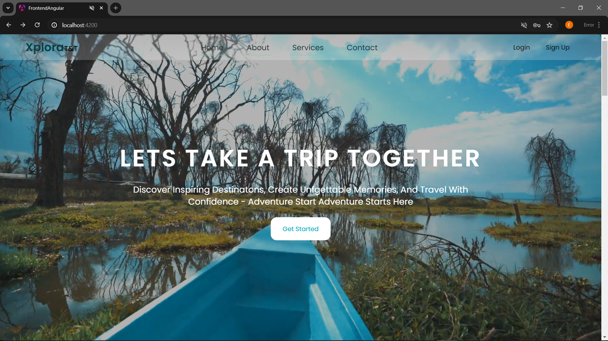 (PNG - Landing Page Hero Section)
2.  (PNG - Full Landing Page View)

## Login
3. 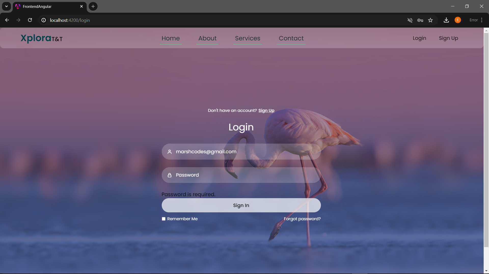 (PNG - Login Form Validation)
4. 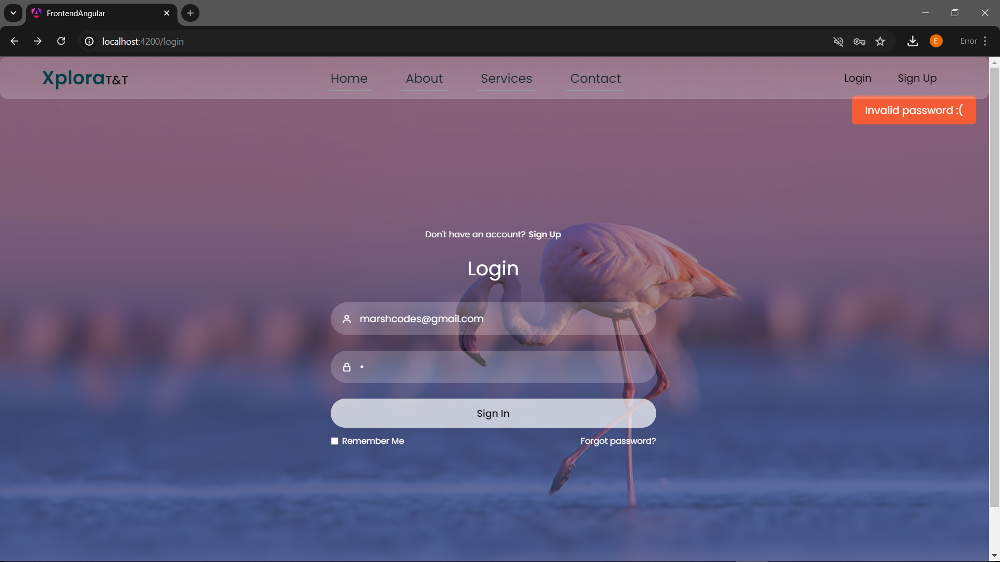 (PNG - Unsuccessful Login Attempt)
5. 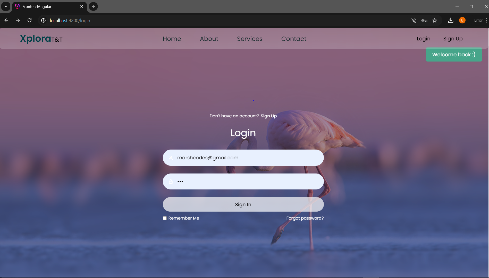 (PNG - Successful Login)

## Signup
6. 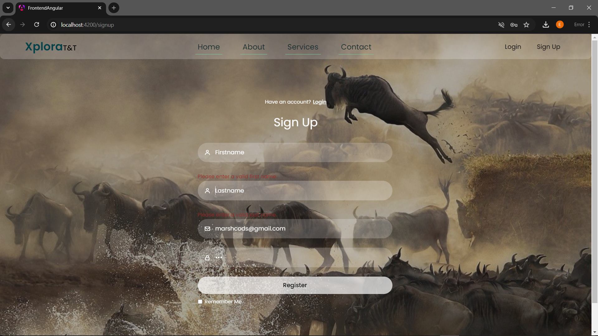 (PNG - Signup Form Validation)
7. 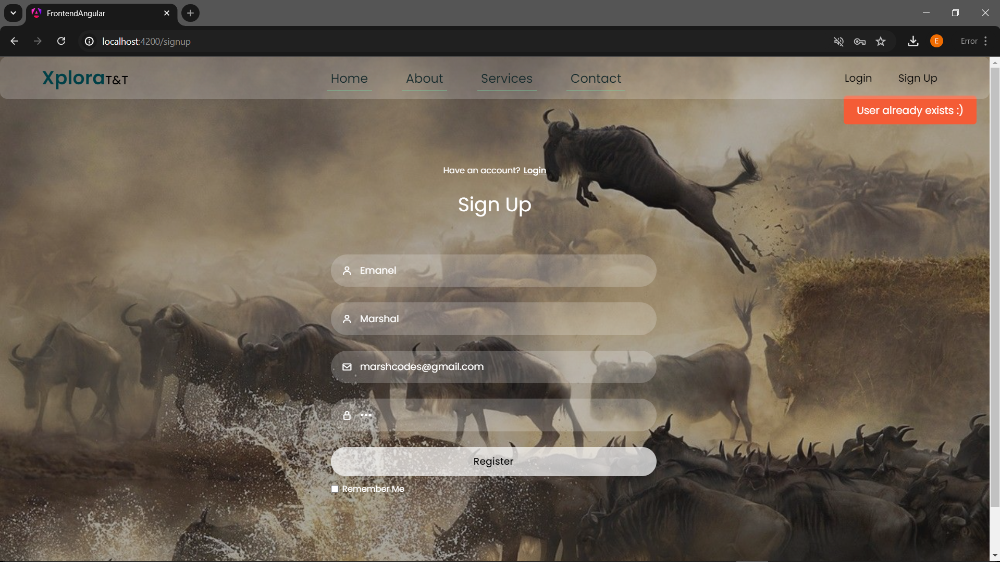 (PNG - Unsuccessful Registration)
8. 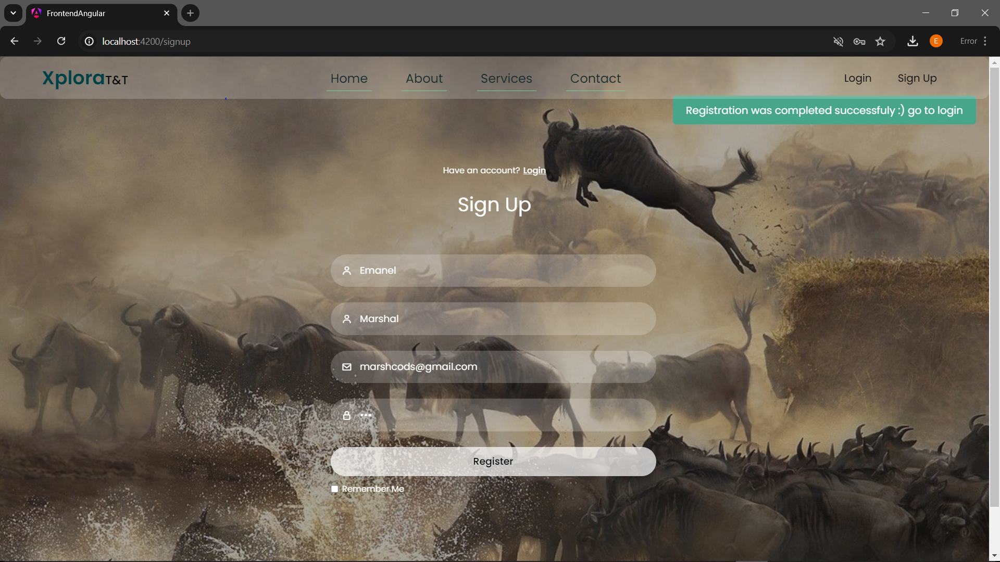 (PNG - Successful Registration)

## Dashboards
9. 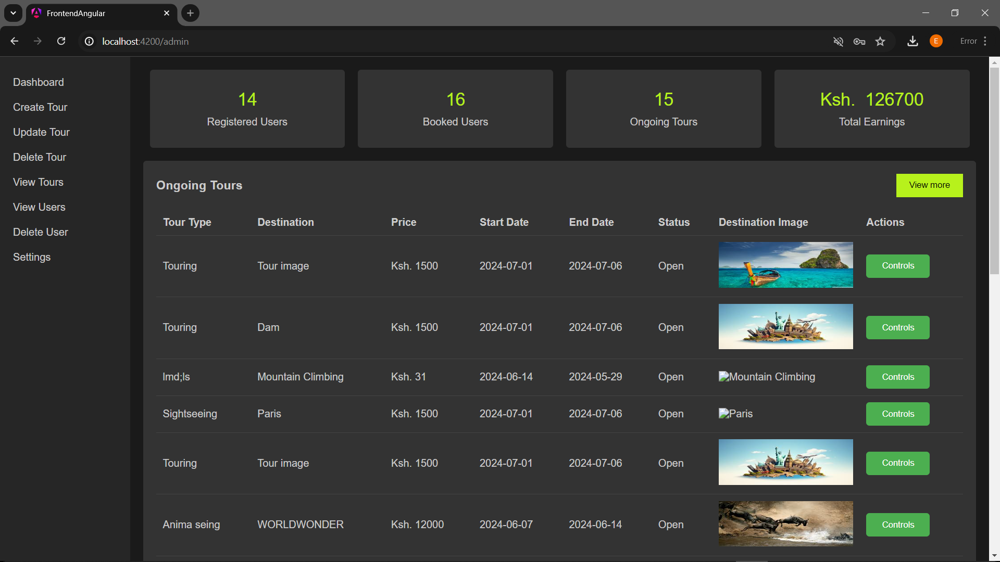 (PNG - Admin Dashboard)
10. 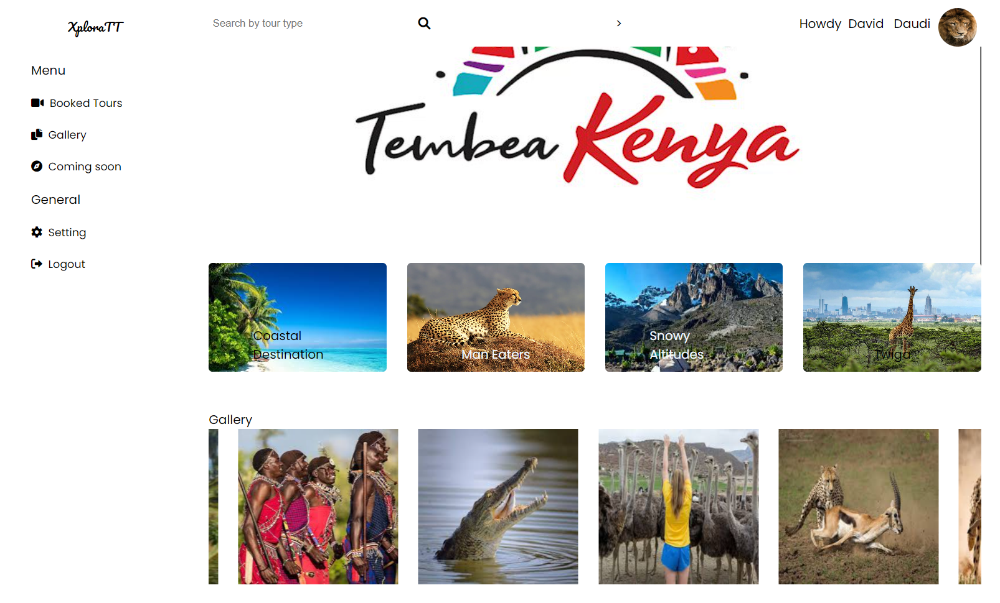 (PNG - User Dashboard)
11. 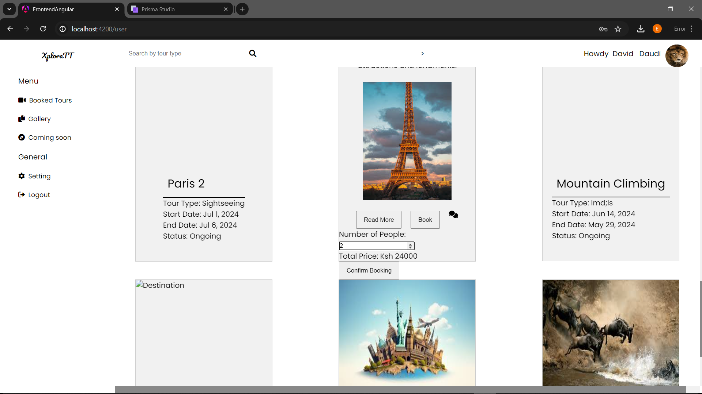 (PNG - User Booking Tour)
12. 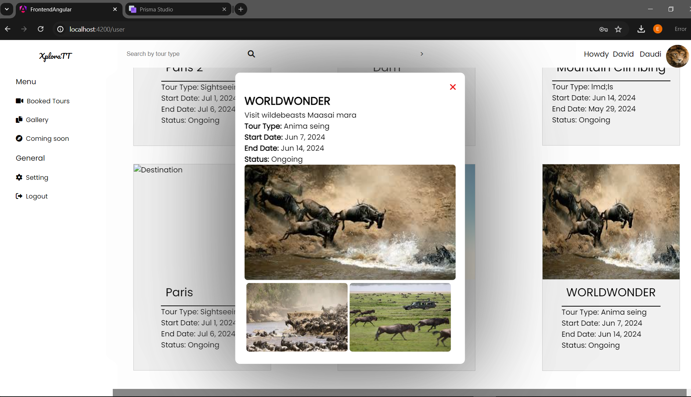 (PNG - View Single Tour Details)


  


